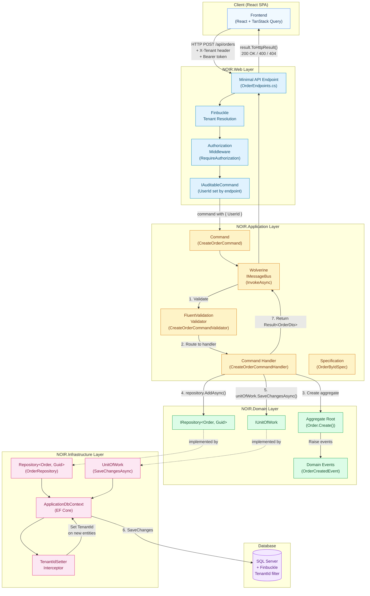
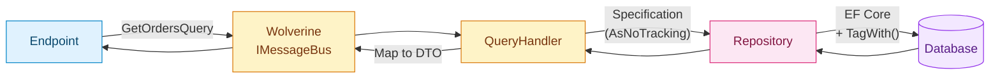
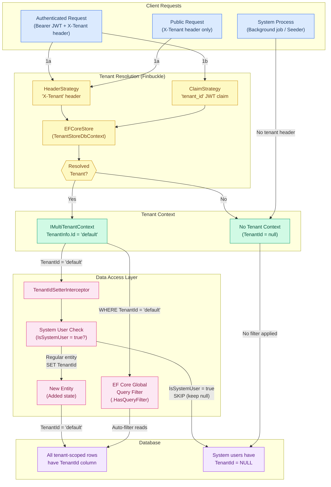
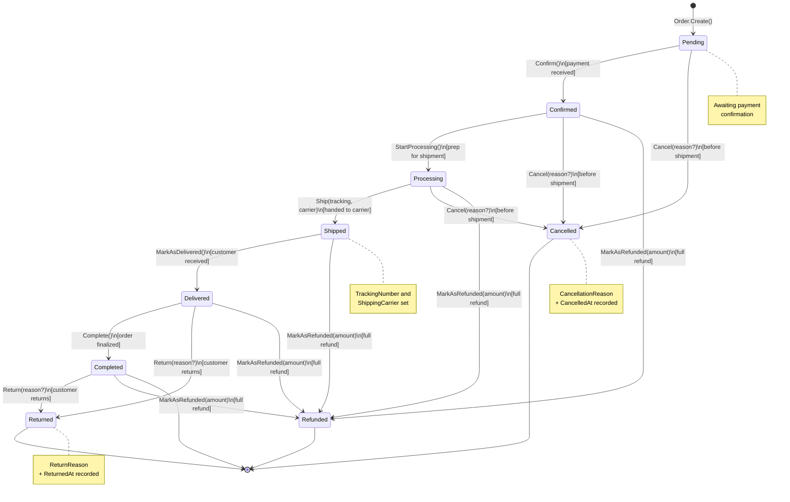
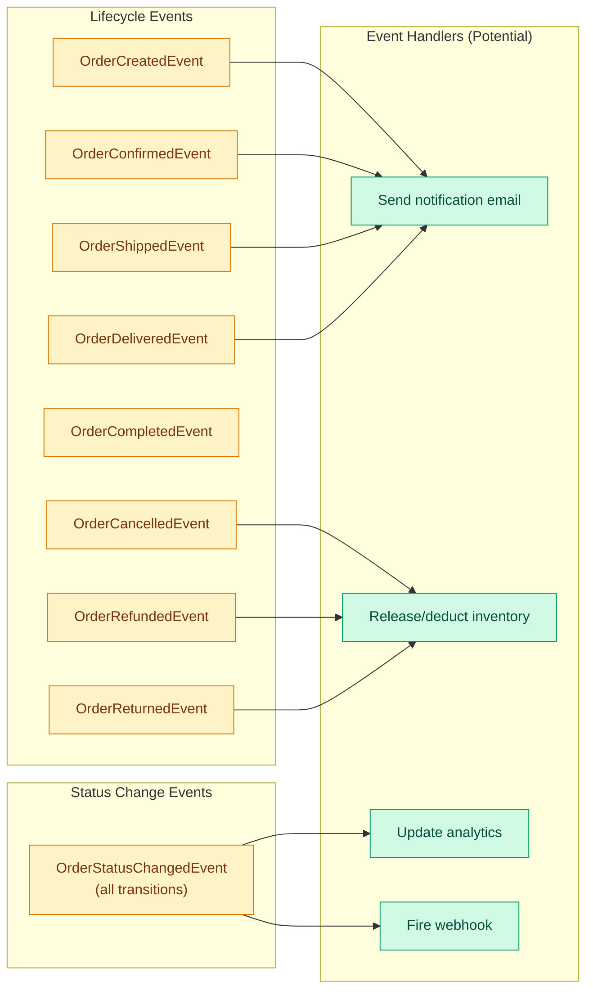

# NOIR Architecture Diagrams

**Last Updated:** 2026-02-18

These diagrams document the core architecture of the NOIR e-commerce platform. All diagrams use Mermaid syntax and can be rendered in GitHub, VS Code (with Mermaid extension), or any Mermaid-compatible viewer.

---

## Table of Contents

1. [E-commerce Entity Relationship Diagram](#1-e-commerce-entity-relationship-diagram)
2. [CQRS Command Flow Diagram](#2-cqrs-command-flow-diagram)
3. [Multi-Tenancy Architecture Diagram](#3-multi-tenancy-architecture-diagram)
4. [Order Lifecycle State Diagram](#4-order-lifecycle-state-diagram)

---

## 1. E-commerce Entity Relationship Diagram

Shows relationships between all e-commerce domain entities including products, orders, payments, cart, checkout, and inventory.

```mermaid
erDiagram
    %% ============================================
    %% PRODUCT CATALOG
    %% ============================================

    Product {
        Guid Id PK
        string Name
        string Slug
        string ShortDescription
        string Description
        decimal BasePrice
        string Currency
        ProductStatus Status
        Guid CategoryId FK
        Guid BrandId FK
        string Sku
        string Barcode
        bool TrackInventory
        int SortOrder
        string TenantId
    }

    ProductVariant {
        Guid Id PK
        Guid ProductId FK
        string Name
        string Sku
        decimal Price
        decimal CompareAtPrice
        int StockQuantity
        string OptionsJson
        int SortOrder
        Guid ImageId FK
        string TenantId
    }

    ProductImage {
        Guid Id PK
        Guid ProductId FK
        string Url
        string AltText
        bool IsPrimary
        int DisplayOrder
        string TenantId
    }

    ProductCategory {
        Guid Id PK
        string Name
        string Slug
        string Description
        Guid ParentId FK
        int SortOrder
        string ImageUrl
        int ProductCount
        string TenantId
    }

    Brand {
        Guid Id PK
        string Name
        string Slug
        string LogoUrl
        string TenantId
    }

    %% ============================================
    %% PRODUCT ATTRIBUTES
    %% ============================================

    ProductAttribute {
        Guid Id PK
        string Code
        string Name
        AttributeType Type
        bool IsFilterable
        bool IsSearchable
        bool IsRequired
        bool IsVariantAttribute
        bool IsGlobal
        string Unit
        decimal MinValue
        decimal MaxValue
        int SortOrder
        bool IsActive
        string TenantId
    }

    ProductAttributeValue {
        Guid Id PK
        Guid AttributeId FK
        string Value
        string DisplayValue
        string ColorCode
        string SwatchUrl
        int SortOrder
        bool IsActive
        int ProductCount
        string TenantId
    }

    CategoryAttribute {
        Guid Id PK
        Guid CategoryId FK
        Guid AttributeId FK
        bool IsRequired
        int SortOrder
        string TenantId
    }

    ProductAttributeAssignment {
        Guid Id PK
        Guid ProductId FK
        Guid AttributeId FK
        Guid VariantId FK
        Guid AttributeValueId FK
        string AttributeValueIds
        string TextValue
        decimal NumberValue
        bool BoolValue
        DateTime DateValue
        string ColorValue
        string FileUrl
        string DisplayValue
        string TenantId
    }

    %% ============================================
    %% SHOPPING CART
    %% ============================================

    Cart {
        Guid Id PK
        string UserId
        string SessionId
        CartStatus Status
        DateTimeOffset LastActivityAt
        DateTimeOffset ExpiresAt
        string Currency
        string TenantId
    }

    CartItem {
        Guid Id PK
        Guid CartId FK
        Guid ProductId FK
        Guid ProductVariantId FK
        string ProductName
        string VariantName
        string ImageUrl
        decimal UnitPrice
        int Quantity
        string TenantId
    }

    %% ============================================
    %% CHECKOUT
    %% ============================================

    CheckoutSession {
        Guid Id PK
        Guid CartId FK
        string UserId
        CheckoutSessionStatus Status
        DateTimeOffset ExpiresAt
        string CustomerEmail
        string CustomerPhone
        string TenantId
    }

    %% ============================================
    %% ORDERS
    %% ============================================

    Order {
        Guid Id PK
        string OrderNumber
        Guid CustomerId FK
        OrderStatus Status
        decimal SubTotal
        decimal DiscountAmount
        decimal ShippingAmount
        decimal TaxAmount
        decimal GrandTotal
        string Currency
        string CustomerEmail
        string ShippingMethod
        string TrackingNumber
        Guid CheckoutSessionId FK
        string CouponCode
        string CancellationReason
        string ReturnReason
        string TenantId
    }

    OrderItem {
        Guid Id PK
        Guid OrderId FK
        Guid ProductId FK
        Guid ProductVariantId FK
        string ProductName
        string VariantName
        string Sku
        string ImageUrl
        decimal UnitPrice
        int Quantity
        decimal DiscountAmount
        decimal TaxAmount
        string TenantId
    }

    %% ============================================
    %% PAYMENTS
    %% ============================================

    PaymentTransaction {
        Guid Id PK
        string TransactionNumber
        string GatewayTransactionId
        Guid PaymentGatewayId FK
        string Provider
        Guid OrderId FK
        Guid CustomerId FK
        decimal Amount
        string Currency
        decimal GatewayFee
        decimal NetAmount
        PaymentStatus Status
        PaymentMethod PaymentMethod
        string TenantId
    }

    PaymentGateway {
        Guid Id PK
        string Provider
        string DisplayName
        bool IsActive
        int SortOrder
        GatewayEnvironment Environment
        GatewayHealthStatus HealthStatus
        string SupportedCurrencies
        decimal MinAmount
        decimal MaxAmount
        string TenantId
    }

    Refund {
        Guid Id PK
        string RefundNumber
        Guid PaymentTransactionId FK
        string GatewayRefundId
        decimal Amount
        string Currency
        RefundStatus Status
        RefundReason Reason
        string ReasonDetail
        string TenantId
    }

    %% ============================================
    %% INVENTORY
    %% ============================================

    InventoryMovement {
        Guid Id PK
        Guid ProductVariantId FK
        Guid ProductId FK
        InventoryMovementType MovementType
        int QuantityBefore
        int QuantityMoved
        int QuantityAfter
        string Reference
        string Notes
        string UserId
        string CorrelationId
        string TenantId
    }

    %% ============================================
    %% RELATIONSHIPS
    %% ============================================

    %% Product Catalog
    Product ||--o{ ProductVariant : "has variants"
    Product ||--o{ ProductImage : "has images"
    Product }o--o| ProductCategory : "belongs to"
    Product }o--o| Brand : "branded by"
    ProductCategory ||--o{ ProductCategory : "parent-child"

    %% Product Attributes
    ProductAttribute ||--o{ ProductAttributeValue : "has predefined values"
    ProductCategory ||--o{ CategoryAttribute : "defines available attrs"
    ProductAttribute ||--o{ CategoryAttribute : "assigned to categories"
    Product ||--o{ ProductAttributeAssignment : "has attr values"
    ProductAttribute ||--o{ ProductAttributeAssignment : "value for attr"
    ProductAttributeValue ||--o{ ProductAttributeAssignment : "selected value"
    ProductVariant ||--o{ ProductAttributeAssignment : "variant-specific"

    %% Shopping Cart
    Cart ||--o{ CartItem : "contains"
    CartItem }o--|| Product : "references"
    CartItem }o--|| ProductVariant : "specific variant"

    %% Checkout
    CheckoutSession }o--|| Cart : "checks out"
    Order }o--o| CheckoutSession : "created from"

    %% Orders
    Order ||--o{ OrderItem : "contains"
    OrderItem }o--|| Product : "snapshot of"
    OrderItem }o--|| ProductVariant : "snapshot of"

    %% Payments
    Order ||--o{ PaymentTransaction : "paid via"
    PaymentTransaction }o--|| PaymentGateway : "processed by"
    PaymentTransaction ||--o{ Refund : "refunded via"

    %% Inventory
    ProductVariant ||--o{ InventoryMovement : "stock history"
    Product ||--o{ InventoryMovement : "stock history"
    ProductVariant ||--o| ProductImage : "variant image"
```



### Entity Legend

| Domain | Entities | Base Class |
|--------|----------|------------|
| **Product Catalog** | Product, ProductVariant, ProductImage, ProductCategory, Brand | TenantAggregateRoot / TenantEntity |
| **Attributes** | ProductAttribute, ProductAttributeValue, CategoryAttribute, ProductAttributeAssignment | TenantAggregateRoot / TenantEntity |
| **Cart** | Cart, CartItem | TenantAggregateRoot / TenantEntity |
| **Checkout** | CheckoutSession | TenantAggregateRoot |
| **Orders** | Order, OrderItem | TenantAggregateRoot / TenantEntity |
| **Payments** | PaymentTransaction, PaymentGateway, Refund | TenantAggregateRoot |
| **Inventory** | InventoryMovement | TenantAggregateRoot |

---

## 2. CQRS Command Flow Diagram

Shows how a request flows through the NOIR architecture using Wolverine message bus, from HTTP endpoint to database persistence.



### CQRS Flow Steps

| Step | Component | Layer | Description |
|------|-----------|-------|-------------|
| 1 | Endpoint | Web | Receives HTTP request, resolves tenant, authenticates user |
| 2 | Endpoint | Web | Sets `UserId` on `IAuditableCommand` for audit trail |
| 3 | Validator | Application | FluentValidation validates the command before handler runs |
| 4 | Handler | Application | Business logic; creates/modifies aggregate roots |
| 5 | Aggregate | Domain | Factory methods enforce invariants, raise domain events |
| 6 | Repository | Infrastructure | `AddAsync()` / `UpdateAsync()` stages changes in DbContext |
| 7 | UnitOfWork | Infrastructure | `SaveChangesAsync()` persists all changes atomically |
| 8 | Interceptor | Infrastructure | `TenantIdSetterInterceptor` auto-sets TenantId on new entities |
| 9 | Handler | Application | Returns `Result<TDto>` with success/failure information |

### Query Flow (Read Path)



**Key differences from Command path:**
- No validation step (queries are read-only)
- Specifications use `AsNoTracking` by default (no change tracking overhead)
- No UnitOfWork needed (no mutations)
- All specs tagged with `TagWith("MethodName")` for SQL debugging

---

## 3. Multi-Tenancy Architecture Diagram

Shows how Finbuckle.MultiTenant resolves the current tenant and how TenantId is enforced across the stack.



### Tenant Resolution Priority

| Priority | Strategy | Source | When Used |
|----------|----------|--------|-----------|
| 1 | `WithHeaderStrategy("X-Tenant")` | HTTP header | All requests (auth + public) |
| 2 | `WithClaimStrategy("tenant_id")` | JWT claim | Authenticated requests |

**No fallback strategy**: If neither resolves a tenant, the tenant context is null. This is intentional -- system processes (seeders, background jobs) operate without tenant scope.

### Critical Rules

1. **System users (platform admins)** have `IsSystemUser = true` and `TenantId = null` -- the interceptor explicitly skips them
2. **Public endpoints** (login, forgot-password) use `apiClientPublic` which sends `X-Tenant: default` header
3. **Login endpoint** is special -- it resolves tenant from the user's email in the command body, not from the header
4. **Unique constraints** on tenant-scoped entities MUST include TenantId: `HasIndex(e => new { e.Slug, e.TenantId }).IsUnique()`
5. **Global query filters** automatically add `WHERE TenantId = @tenantId` to all queries for tenant-scoped entities

---

## 4. Order Lifecycle State Diagram

Shows all valid state transitions for an Order, derived directly from the `Order.cs` domain entity methods and their guard clauses.



### State Transition Matrix

This matrix shows which transitions are valid, derived from the guard clauses in `Order.cs`:

| From \ To | Pending | Confirmed | Processing | Shipped | Delivered | Completed | Cancelled | Refunded | Returned |
|-----------|---------|-----------|------------|---------|-----------|-----------|-----------|----------|----------|
| **Pending** | - | Confirm() | - | - | - | - | Cancel() | - | - |
| **Confirmed** | - | - | StartProcessing() | - | - | - | Cancel() | MarkAsRefunded() | - |
| **Processing** | - | - | - | Ship() | - | - | Cancel() | MarkAsRefunded() | - |
| **Shipped** | - | - | - | - | MarkAsDelivered() | - | - | MarkAsRefunded() | - |
| **Delivered** | - | - | - | - | - | Complete() | - | MarkAsRefunded() | Return() |
| **Completed** | - | - | - | - | - | - | - | MarkAsRefunded() | Return() |
| **Cancelled** | - | - | - | - | - | - | - | - | - |
| **Refunded** | - | - | - | - | - | - | - | - | - |
| **Returned** | - | - | - | - | - | - | - | - | - |

### Guard Clause Summary

| Method | Required Status | Side Effects |
|--------|----------------|--------------|
| `Confirm()` | Pending | Sets ConfirmedAt, raises OrderConfirmedEvent |
| `StartProcessing()` | Confirmed | Raises OrderStatusChangedEvent |
| `Ship(tracking, carrier)` | Processing | Sets ShippedAt, TrackingNumber, ShippingCarrier, raises OrderShippedEvent |
| `MarkAsDelivered()` | Shipped | Sets DeliveredAt, raises OrderDeliveredEvent |
| `Complete()` | Delivered | Sets CompletedAt, raises OrderCompletedEvent |
| `Cancel(reason?)` | Pending, Confirmed, Processing | Sets CancelledAt, CancellationReason, raises OrderCancelledEvent |
| `Return(reason?)` | Delivered, Completed | Sets ReturnedAt, ReturnReason, raises OrderReturnedEvent |
| `MarkAsRefunded(amount)` | NOT Pending, Cancelled, Refunded | Raises OrderRefundedEvent |

### Domain Events Raised



---

## Appendix: Entity Base Classes

All domain entities inherit from a base class hierarchy that provides multi-tenancy and audit fields:

```
BaseEntity<TId>                    -- Id, DomainEvents
  |
  +-- AggregateRoot<TId>           -- (marker for aggregate boundary)
  |     |
  |     +-- TenantAggregateRoot<TId>  -- TenantId, CreatedAt, ModifiedAt
  |     |
  |     +-- PlatformTenantAggregateRoot<TId>  -- Cross-tenant access
  |
  +-- Entity<TId>                  -- (non-aggregate entities)
        |
        +-- TenantEntity<TId>     -- TenantId
        |
        +-- PlatformTenantEntity<TId>  -- Cross-tenant access
```

**Key pattern**: Aggregate roots are the only entities that can be directly persisted via `IRepository<T, TId>`. Child entities (like `OrderItem`, `CartItem`) are managed through their parent aggregate.

---

## Appendix: Technology Stack Reference

| Layer | Technology | Purpose |
|-------|-----------|---------|
| **Frontend** | React 19, TypeScript, TanStack Query v5 | SPA client |
| **UI Components** | shadcn/ui, Tailwind CSS 4, Radix UI | Component library |
| **API** | ASP.NET Core Minimal APIs | HTTP endpoints |
| **Message Bus** | Wolverine | CQRS command/query routing |
| **ORM** | EF Core 8 | Database access |
| **Multi-Tenancy** | Finbuckle.MultiTenant | Tenant isolation |
| **Validation** | FluentValidation | Command/query validation |
| **Database** | SQL Server | Persistence |
| **Auth** | ASP.NET Core Identity + JWT | Authentication |

---

**End of Architecture Diagrams**
