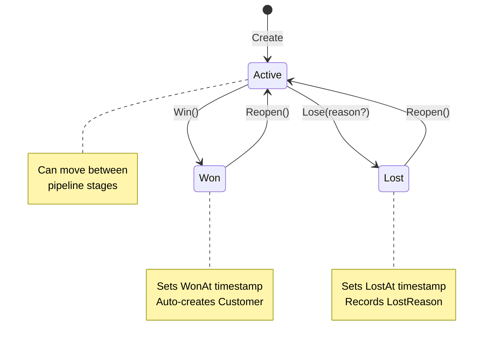

# Lead Pipeline State Machine

## Overview

The CRM lead pipeline implements a state machine governing lead lifecycle transitions (Active, Won, Lost), Kanban board persistence with float-based ordering, and automatic Customer creation on lead conversion. State transitions are enforced at both the domain and application layers.

**Key files:**
- Domain: `src/NOIR.Domain/Entities/Crm/Lead.cs`
- Enum: `src/NOIR.Domain/Enums/LeadStatus.cs`
- Events: `src/NOIR.Domain/Events/Crm/CrmEvents.cs`
- Commands: `src/NOIR.Application/Features/Crm/Commands/{WinLead,LoseLead,ReopenLead,MoveLeadStage,ReorderLead}/`

## Lead Status Flow



### LeadStatus Enum

```csharp
public enum LeadStatus
{
    Active = 0,  // Default on creation, can move between stages
    Won = 1,     // Deal closed successfully
    Lost = 2     // Deal lost, optional reason captured
}
```

## Pipeline and Stage Structure

A **Pipeline** is a named container of ordered stages. One pipeline per tenant is marked `IsDefault`. A **PipelineStage** belongs to a pipeline and has an integer `SortOrder` and a `Color` for Kanban column headers.

```
Pipeline (TenantAggregateRoot)
├── Name, IsDefault
└── Stages: List<PipelineStage>
    ├── Name, SortOrder (int), Color (hex)
    └── PipelineId (FK)

Lead (TenantAggregateRoot)
├── PipelineId, StageId (FK to current stage)
├── SortOrder (double) ← position within stage column
├── Status: LeadStatus
├── ContactId, CompanyId?, OwnerId?
├── Value, Currency, ExpectedCloseDate
└── WonAt?, LostAt?, LostReason?
```

## Kanban Drag-Drop Persistence

### Float-Based SortOrder for Insert-Between

Lead `SortOrder` is a `double`, enabling insert-between positioning without reindexing. When a lead is dragged between two existing leads, the frontend calculates the midpoint:

```
Before:  Lead A (1.0)  Lead B (2.0)  Lead C (3.0)
Drop D between A and B → D.SortOrder = 1.5
Result:  Lead A (1.0)  Lead D (1.5)  Lead B (2.0)  Lead C (3.0)
```

Two commands handle Kanban operations:

| Command | Action | Constraint |
|---------|--------|------------|
| `MoveLeadStageCommand` | Change stage + set new SortOrder | Active leads only |
| `ReorderLeadCommand` | Change SortOrder within same stage | No status check |

Both call `lead.MoveToStage(stageId, sortOrder)` on the domain entity.

### Won/Lost Virtual Columns

The Kanban board renders Won and Lost as virtual columns (not real pipeline stages). Leads in these columns have `Status = Won` or `Status = Lost` and retain their last `StageId` for context if reopened.

## Lead to Customer Auto-Conversion

When a lead is won via `WinLeadCommandHandler`, the system automatically creates a Customer from the associated Contact -- but only if the contact has no existing customer link:

```csharp
// In WinLeadCommandHandler
if (contact is not null && contact.CustomerId is null)
{
    var customer = Customer.Create(
        null, contact.Email, contact.FirstName,
        contact.LastName, contact.Phone, tenantId);

    await _customerRepository.AddAsync(customer, ct);
    contact.Update(/* ... customerId: customer.Id ... */);
}
```

This bridges CRM and e-commerce: a won deal creates a purchasable customer record and back-links it to the CRM contact.

## State Guard Pattern

Domain methods (`Win()`, `Lose()`, `Reopen()`) throw `InvalidOperationException` on invalid transitions. Handlers **must** pre-check status before calling the domain method to return a proper `Result.Failure` instead of an unhandled exception.

```csharp
// CORRECT: guard at handler level, then call domain method
if (lead.Status != LeadStatus.Active)
{
    return Result.Failure<LeadDto>(
        Error.Validation("LeadId", "Only active leads can be won."));
}
lead.Win(); // safe -- guard already passed

// WRONG: catching InvalidOperationException from domain
try { lead.Win(); }
catch (InvalidOperationException ex) { /* too late */ }
```

### Transition Rules Summary

| Current Status | Win() | Lose() | Reopen() | MoveToStage() |
|---------------|-------|--------|----------|---------------|
| Active | Allowed | Allowed | Blocked | Allowed |
| Won | Blocked | Blocked | Allowed | Blocked |
| Lost | Blocked | Blocked | Allowed | Blocked |

## Delete Guards

Deleting CRM entities is blocked when dependent active leads or contacts exist:

| Entity | Guard | Error Message |
|--------|-------|---------------|
| **Contact** | Has active leads (LeadStatus.Active) | "Cannot delete contact with active deals." |
| **Company** | Has any contacts | "Cannot delete company with existing contacts." |
| **Pipeline** | Is default pipeline | "Cannot delete the default pipeline." |
| **Pipeline** | Has active leads | "Cannot delete pipeline with active leads." |
| **Pipeline Stage** | Has active leads (checked during UpdatePipeline) | "Cannot remove stage '{name}' with active leads." |

All deletions are soft-delete (entities extend `TenantAggregateRoot` with `IsDeleted`).

## Domain Events

Four domain events are raised during lead lifecycle transitions:

| Event | Raised By | Payload |
|-------|-----------|---------|
| `LeadCreatedEvent` | `Lead.Create()` | `LeadId` |
| `LeadWonEvent` | `Lead.Win()` | `LeadId`, `ContactId`, `CustomerId?` |
| `LeadLostEvent` | `Lead.Lose()` | `LeadId`, `Reason?` |
| `LeadReopenedEvent` | `Lead.Reopen()` | `LeadId` |

All events extend `DomainEvent` and are dispatched via MediatR after `SaveChangesAsync`. Handlers also publish `EntityUpdateSignal` via SignalR for real-time UI refresh on Kanban boards.

## Related Patterns

- [Repository + Specification](./repository-specification.md) -- all lead queries use Specifications
- [Bulk Operations](./bulk-operations.md) -- `BulkOperationResultDto` pattern
- [Hierarchical Audit Logging](./hierarchical-audit-logging.md) -- `IAuditableCommand` on mutation commands
