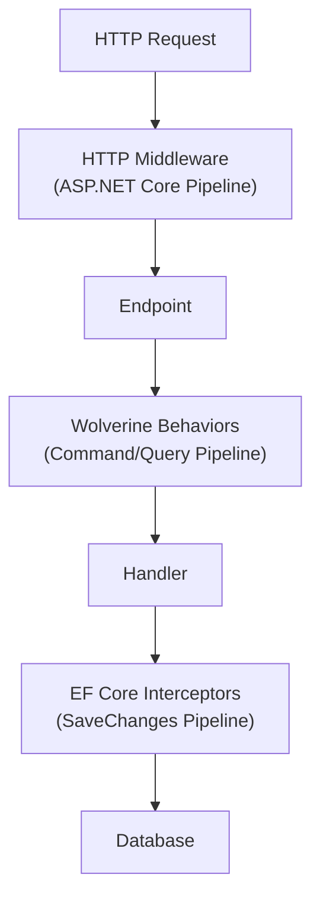
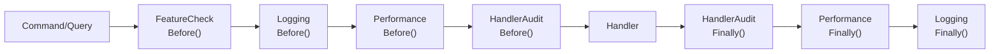
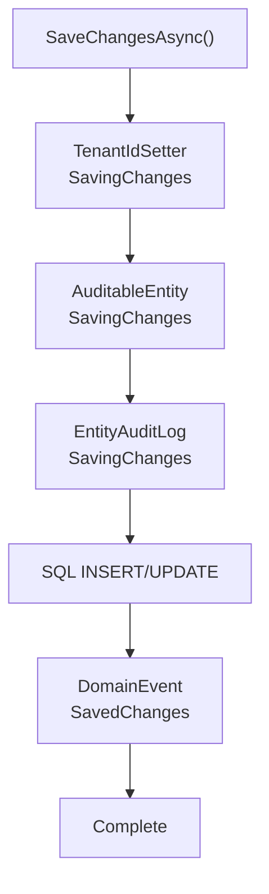

# Middleware & Interceptor Architecture

**Created:** 2026-03-08

---

## Overview

NOIR uses three layers of middleware/interceptors, each operating at a different scope:

| Layer | Scope | Technology | Location |
|-------|-------|-----------|----------|
| **HTTP Middleware** | Every HTTP request | ASP.NET Core pipeline | `Web/Middleware/` |
| **Wolverine Behaviors** | Every command/query handler | Wolverine `Policies.AddMiddleware` | `Application/Behaviors/` |
| **EF Core Interceptors** | Every `SaveChanges` call | `SaveChangesInterceptor` | `Infrastructure/Persistence/Interceptors/` |



---

## HTTP Middleware Pipeline

Order matters -- middleware runs top-to-bottom on request, bottom-to-top on response. Registration order from `Program.cs`:

| # | Middleware | Purpose |
|---|-----------|---------|
| 1 | `UseSerilogRequestLogging` | Structured request logs; 4xx=Warning, 5xx=Error |
| 2 | `ExceptionHandlingMiddleware` | Catches all exceptions, returns RFC 7807 ProblemDetails |
| 3 | `SecurityHeadersMiddleware` | X-Frame-Options, CSP (path-specific), HSTS |
| 4 | `UseCors` | CORS headers (before HTTPS redirect for preflight) |
| 5 | `UseHttpsRedirection` / `UseHsts` | Production only (skipped in dev for Vite proxy) |
| 6 | `UseDefaultFiles` / `UseStaticFiles` | SPA build output from `wwwroot` |
| 7 | `UseRouting` | Endpoint routing (before rate limiter) |
| 8 | `UseRateLimiter` | Endpoint-specific rate limiting policies |
| 9 | `UseResponseCompression` | Response compression |
| 10 | `UseOutputCache` | Server-side output caching |
| 11 | `UseAuthentication` | JWT bearer token validation |
| 12 | `FeedTenantMiddleware` | Sets X-Tenant header for public feed routes (RSS, Sitemap) |
| 13 | `UseMultiTenant` | Finbuckle tenant resolution (Header + Claim strategies) |
| 14 | `CurrentUserLoaderMiddleware` | Loads full user profile into `HttpContext.Items` cache |
| 15 | `UseAuthorization` | Permission/role checks |
| 16 | `HttpRequestAuditMiddleware` | Request/response audit logging (needs user + tenant context) |

### Key Ordering Constraints

- **ExceptionHandling** must be early -- wraps everything to catch unhandled exceptions.
- **CORS before HTTPS redirect** -- preflight (OPTIONS) must get CORS headers before any redirect.
- **Authentication before MultiTenant** -- `ClaimStrategy` needs `HttpContext.User` populated.
- **FeedTenant before MultiTenant** -- injects `X-Tenant` header so Finbuckle HeaderStrategy picks it up.
- **CurrentUserLoader after Authentication + MultiTenant** -- needs both user identity and tenant context.
- **HttpRequestAudit last** -- needs user identity, tenant context, and authorization results.

---

## Wolverine Behaviors (Command/Query Pipeline)

Registered globally via `opts.Policies.AddMiddleware<T>()` in `Program.cs`. All handlers automatically get these behaviors in registration order:

### 1. FeatureCheckMiddleware

Gates execution based on `[RequiresFeature("ModuleName")]` attribute on the command/query type. Caches attribute reflection in a `ConcurrentDictionary`. Throws `FeatureNotAvailableException` (HTTP 403) if any required feature is disabled for the current tenant.

```csharp
[RequiresFeature(ModuleNames.Ecommerce.Products)]
public record CreateProductCommand(...) : IRequest<Result<Guid>>;
```

### 2. LoggingMiddleware

Logs `Before` (message type + correlation ID) and `Finally` (duration in ms). Does not log success/failure -- that is determined by HTTP response status via Serilog request logging.

### 3. PerformanceMiddleware

Warns on slow handlers exceeding threshold (default 500ms, configurable via `Performance:SlowHandlerThresholdMs` in appsettings). Only logs in `Finally` to capture total handler duration.

### 4. HandlerAuditMiddleware

Captures handler execution with DTO diff for the Activity Timeline. Works with `IAuditableCommand` to record before/after state of entities.

### Execution Flow



---

## EF Core Interceptors (SaveChanges Pipeline)

Registered in `Infrastructure/DependencyInjection.cs` via `options.AddInterceptors(...)`. Execution order follows registration order:

### 1. TenantIdSetterInterceptor (SavingChanges)

Sets `TenantId` on new `ITenantEntity` entities from Finbuckle current tenant context. Skips system users (`IsSystemUser = true`) to keep them tenant-agnostic. Only sets on `EntityState.Added` with empty `TenantId` -- never changes tenant on updates.

### 2. AuditableEntityInterceptor (SavingChanges)

Sets audit fields (`CreatedAt`, `CreatedBy`, `ModifiedAt`, `ModifiedBy`) on `IAuditableEntity`. Converts hard deletes to soft deletes by flipping `IsDeleted = true` and setting `DeletedAt`/`DeletedBy`.

### 3. DomainEventInterceptor (SavedChanges)

Dispatches domain events via Wolverine `IMessageBus` **after** successful save. Collects events from `IAggregateRoot.DomainEvents`, clears them, then publishes. Enforces async-only -- throws on synchronous `SaveChanges()`.

### 4. EntityAuditLogInterceptor (SavingChanges)

Creates `EntityAuditLog` entries with RFC 6902 JSON Patch diffs for all entity changes. Respects `[DisableAuditing]` and `[AuditSensitive]` attributes. Excludes audit log entities themselves to prevent recursion. Tracks collection changes via `[AuditCollection]`.

### Execution Flow



**Key distinction:** `SavingChanges` interceptors run **before** the SQL executes (can modify entities). `SavedChanges` runs **after** successful commit (safe for side effects like event dispatch).

---

## Adding New Middleware

### HTTP Middleware

1. Create class in `Web/Middleware/` implementing the `InvokeAsync(HttpContext, RequestDelegate)` pattern.
2. Register in `Program.cs` with `app.UseMiddleware<T>()` at the correct position.
3. Consider creating an extension method (`UseXxx`) for readability.
4. **Order matters** -- document why your middleware needs its specific position.

### Wolverine Behavior

1. Create class in `Application/Behaviors/` with `Before()`, `After()`, and/or `Finally()` methods.
2. Register in `Program.cs` inside the Wolverine configuration: `opts.Policies.AddMiddleware<T>()`.
3. Use `Envelope` parameter to access message metadata (not `object` -- Wolverine treats that as a DI dependency).
4. Cache reflection results (e.g., custom attributes) in `ConcurrentDictionary<Type, T>`.

### EF Core Interceptor

1. Create class in `Infrastructure/Persistence/Interceptors/` extending `SaveChangesInterceptor`.
2. Choose the right hook: `SavingChanges` (before SQL) vs `SavedChanges` (after commit).
3. Register as a service, then add to `options.AddInterceptors(...)` in `DependencyInjection.cs`.
4. **Order matters** -- TenantId must be set before audit fields, audit logs need final entity state.

---

## Related Docs

- [Hierarchical Audit Logging](./hierarchical-audit-logging.md) -- 3-level audit system (HTTP, Handler, Entity)
- [DI Auto-Registration](./di-auto-registration.md) -- Scrutor marker interfaces