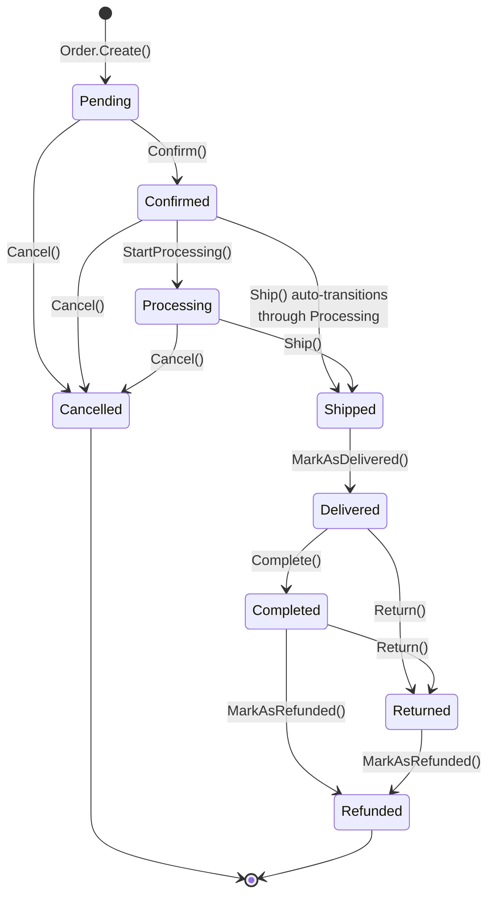

# Order Lifecycle State Machine

**Created:** 2026-03-08
**Status:** Implemented

---

## Overview

The Order entity implements a state machine with 9 statuses and 8 transition methods. All transitions are enforced at the domain level via guard clauses that throw `InvalidOperationException` on illegal transitions. Command handlers catch these exceptions and return `Result.Failure` with typed error codes.

---

## Status Flow



### Allowed Transitions Summary

| From | Allowed To |
|------|-----------|
| Pending | Confirmed, Cancelled |
| Confirmed | Processing, Shipped (auto), Cancelled |
| Processing | Shipped, Cancelled |
| Shipped | Delivered |
| Delivered | Completed, Returned |
| Completed | Returned, Refunded |
| Returned | Refunded |
| Cancelled | (terminal) |
| Refunded | (terminal) |

---

## Lifecycle Commands

| # | Command | From Status | To Status | Side Effects |
|---|---------|-------------|-----------|-------------|
| 1 | `CreateOrder` | (none) | Pending | Generate order number via `IOrderNumberGenerator`, set addresses, items, discounts. Raises `OrderCreatedEvent`. |
| 2 | `ConfirmOrder` | Pending | Confirmed | Sets `ConfirmedAt`. Raises `OrderConfirmedEvent` + `OrderStatusChangedEvent`. |
| 3 | `ShipOrder` | Processing (or Confirmed) | Shipped | **Auto-transitions** from Confirmed through Processing. Sets `ShippedAt`, `TrackingNumber`, `ShippingCarrier`. Raises `OrderShippedEvent`. |
| 4 | `DeliverOrder` | Shipped | Delivered | Sets `DeliveredAt`. Raises `OrderDeliveredEvent`. |
| 5 | `CompleteOrder` | Delivered | Completed | Sets `CompletedAt`. Raises `OrderCompletedEvent`. |
| 6 | `CancelOrder` | Pending, Confirmed, Processing | Cancelled | **Releases inventory** for all items. Sets `CancelledAt`, `CancellationReason`. Raises `OrderCancelledEvent`. |
| 7 | `ReturnOrder` | Delivered, Completed | Returned | **Releases inventory** for all items. Sets `ReturnedAt`, `ReturnReason`. Raises `OrderReturnedEvent`. |
| 8 | `MarkAsRefunded` | Any except Pending, Cancelled, Refunded | Refunded | Triggered via payment webhook. Raises `OrderRefundedEvent(RefundAmount)`. |
| 9 | `AddOrderNote` | Any | (unchanged) | Appends to `InternalNotes`. Raises `OrderNoteAddedEvent`. |
| 10 | `ManualCreateOrder` | (none) | Pending | Admin-initiated order creation (same flow as CreateOrder). |

### Bulk Commands

- `BulkConfirmOrders` -- Confirms multiple pending orders in a single request.
- `BulkCancelOrders` -- Cancels multiple orders with shared cancellation reason.

Both return `BulkOperationResultDto` with per-order success/failure tracking.

---

## State Guard Pattern

Domain methods throw `InvalidOperationException` on invalid transitions. Handlers wrap the call in try-catch and convert to `Result.Failure`:

```csharp
// Domain entity -- guards the transition
public void Confirm()
{
    if (Status != OrderStatus.Pending)
        throw new InvalidOperationException(
            $"Cannot confirm order in {Status} status");

    var oldStatus = Status;
    Status = OrderStatus.Confirmed;
    ConfirmedAt = DateTimeOffset.UtcNow;

    AddDomainEvent(new OrderStatusChangedEvent(Id, OrderNumber, oldStatus, Status));
    AddDomainEvent(new OrderConfirmedEvent(Id, OrderNumber));
}

// Command handler -- catches and returns Result
try
{
    order.Confirm();
}
catch (InvalidOperationException ex)
{
    return Result.Failure<OrderDto>(
        Error.Validation("Status", ex.Message, ErrorCodes.Order.InvalidConfirmTransition));
}
```

Each transition has a dedicated error code: `InvalidConfirmTransition`, `InvalidShipTransition`, `InvalidCancelTransition`, etc.

### Auto-Transition: Ship from Confirmed

`ShipOrderCommandHandler` includes an intentional auto-transition. If the order is in `Confirmed` status, it calls `StartProcessing()` before `Ship()`. The `Processing` state has no dedicated frontend action -- it is an internal fulfillment step.

```csharp
if (order.Status == OrderStatus.Confirmed)
{
    order.StartProcessing();
}

order.Ship(command.TrackingNumber, command.ShippingCarrier);
```

This produces two domain events: `OrderStatusChangedEvent(Confirmed -> Processing)` and `OrderShippedEvent`.

---

## Inventory Impact

Two commands modify inventory: **CancelOrder** and **ReturnOrder**. Both iterate over `order.Items`, look up each product variant, and call `variant.ReleaseStock(quantity)`.

```csharp
foreach (var item in order.Items)
{
    var product = await _productRepository.FirstOrDefaultAsync(
        new ProductByIdForUpdateSpec(item.ProductId), ct);
    if (product is null) continue;

    var variant = product.Variants.FirstOrDefault(v => v.Id == item.ProductVariantId);
    if (variant is null) continue;

    var quantityBefore = variant.StockQuantity;
    variant.ReleaseStock(item.Quantity);

    await _movementLogger.LogMovementAsync(
        variant,
        movementType,      // ReservationRelease (cancel) or Return (return)
        quantityBefore,
        item.Quantity,
        reference: order.OrderNumber,
        notes: $"...",
        userId: command.UserId,
        cancellationToken: ct);
}
```

| Transition | Movement Type | Stock Effect |
|-----------|--------------|-------------|
| Cancel | `ReservationRelease` | +quantity (returns to available) |
| Return | `Return` | +quantity (returns to available) |

Stock is **reserved** during checkout (not in these handlers). The order lifecycle only **releases** reserved stock when cancelled or returned.

---

## Payment Integration

Refunds are triggered through the payment system, not the order lifecycle directly:

1. Payment webhook received -> `ProcessWebhookCommandHandler` processes refund event
2. `PaymentTransaction.MarkAsRefunded()` updates payment status
3. `Order.MarkAsRefunded(refundAmount)` transitions the order
4. `OrderRefundedEvent` raised with refund amount -> notification handler sends email

The `Cancel()` guard explicitly blocks cancellation of `Shipped`, `Delivered`, `Completed`, `Cancelled`, and `Refunded` orders. For post-shipment issues, the Return -> Refund path must be used.

---

## Domain Events

Every status transition raises `OrderStatusChangedEvent(OrderId, OrderNumber, OldStatus, NewStatus, Reason?)` plus a specific event:

| Event | Payload | Triggered By |
|-------|---------|-------------|
| `OrderCreatedEvent` | OrderId, OrderNumber, CustomerEmail, GrandTotal, Currency | `Order.Create()` |
| `OrderConfirmedEvent` | OrderId, OrderNumber | `Confirm()` |
| `OrderShippedEvent` | OrderId, OrderNumber, TrackingNumber, ShippingCarrier | `Ship()` |
| `OrderDeliveredEvent` | OrderId, OrderNumber | `MarkAsDelivered()` |
| `OrderCompletedEvent` | OrderId, OrderNumber | `Complete()` |
| `OrderCancelledEvent` | OrderId, OrderNumber, CancellationReason | `Cancel()` |
| `OrderRefundedEvent` | OrderId, OrderNumber, RefundAmount | `MarkAsRefunded()` |
| `OrderReturnedEvent` | OrderId, OrderNumber, ReturnReason | `Return()` |
| `OrderNoteAddedEvent` | OrderId, Note, IsInternal | `AddInternalNote()` |

All events extend `DomainEvent` and are dispatched via Wolverine after `SaveChangesAsync`. The `OrderNotificationHandler` consumes these events to send customer emails and create in-app notifications.

---

## Handler Structure

All lifecycle command handlers follow the same pattern:

```
Features/Orders/Commands/{Action}/
+-- {Action}Command.cs          -- Command record with OrderId + action-specific fields
+-- {Action}CommandHandler.cs   -- Wolverine handler (fetch, guard, mutate, save, signal)
+-- {Action}CommandValidator.cs -- FluentValidation rules
```

Standard handler flow:

1. Fetch order with `OrderByIdForUpdateSpec` (includes `AsTracking()` + items)
2. Guard via domain method (try-catch `InvalidOperationException`)
3. Perform side effects (inventory release, payment, etc.)
4. `SaveChangesAsync()` -- domain events dispatched here
5. `PublishEntityUpdatedAsync()` -- SignalR real-time signal

---

## Testing

### Domain Unit Tests

Test each transition method for both valid and invalid source states:

```csharp
[Fact]
public void Confirm_WhenPending_ShouldTransitionToConfirmed()
{
    var order = CreatePendingOrder();
    order.Confirm();
    order.Status.Should().Be(OrderStatus.Confirmed);
    order.ConfirmedAt.Should().NotBeNull();
}

[Theory]
[InlineData(OrderStatus.Confirmed)]
[InlineData(OrderStatus.Shipped)]
[InlineData(OrderStatus.Cancelled)]
public void Confirm_WhenNotPending_ShouldThrow(OrderStatus status)
{
    var order = CreateOrderInStatus(status);
    var act = () => order.Confirm();
    act.Should().Throw<InvalidOperationException>();
}
```

### Handler Unit Tests

Mock the repository, assert `Result.IsSuccess` for valid transitions and `Result.IsFailure` for invalid ones. For `CancelOrder` and `ReturnOrder`, verify inventory release calls via `IInventoryMovementLogger` mock.

### Integration Tests

Use `CustomWebApplicationFactory` to test full endpoint -> handler -> database flow. Verify status persisted, domain events raised, and SignalR signals published.

---

## File Locations

| Concern | Path |
|---------|------|
| Entity | `src/NOIR.Domain/Entities/Order/Order.cs` |
| Status enum | `src/NOIR.Domain/Enums/OrderStatus.cs` |
| Domain events | `src/NOIR.Domain/Events/Order/OrderEvents.cs` |
| Commands | `src/NOIR.Application/Features/Orders/Commands/` |
| Queries | `src/NOIR.Application/Features/Orders/Queries/` |
| Event handlers | `src/NOIR.Application/Features/Orders/EventHandlers/` |
| Specifications | `src/NOIR.Application/Features/Orders/Specifications/` |
